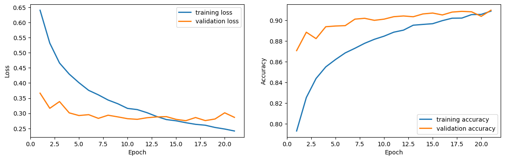
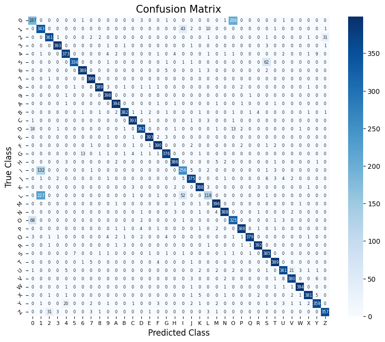

The original idea was bigger than what you see in the notebook. This post is about what I actually built, why I cut scope on purpose, and what the results tell you about building real OCR pipelines.

## The original plan

I wanted to build a three-stage licence plate recognition pipeline:

1. **Plate detector** — a model that takes a full image and locates the licence plate region
2. **Segmenter** — a model that splits the plate into individual character slots
3. **Character classifier** — a model that reads each character slot and outputs the alphanumeric label

Each of those is a real, non-trivial problem. The plate detector alone needs bounding-box regression; the segmenter has to deal with variable spacing, skew, and noise. Put the three together and you have the kind of computer vision pipeline that production systems like parking enforcement cameras or toll gates actually use.

The problem was time. Building and tuning three models, curating datasets for each, and wiring them into a coherent pipeline was simply too much scope for a single university project, so I made a deliberate trade.

## Cutting scope without cutting corners

I dropped the plate detector and the segmenter and focused entirely on stage three: the character classifier. That might sound like doing a third of the work, but the cut gave me something valuable. It gave me space to do that one thing properly.

The first decision was about the data. EMNIST Balanced is the standard benchmark for this kind of task: 112,800 training images across 47 classes covering digits, uppercase letters, and some lowercase letters. But licence plates don't use lowercase. Keeping those 11 extra classes would just add noise and make the model work harder to distinguish characters it would never actually see on a real plate.

I stripped the lowercase classes out entirely, leaving **36 classes**: digits `0–9` and uppercase `A–Z`. The training set dropped from 112,800 to 86,400 images and the test set from 18,800 to 14,400. Smaller, but cleaner and purpose-built for the actual problem. Removing irrelevant data is often more impactful than adding model complexity.

## The architecture

### Network design

I built a modest CNN in Keras:

```
Input (28×28 grayscale)
  → Conv2D(36, 3×3) + BatchNorm + ReLU + MaxPool
  → Conv2D(72, 3×3) + BatchNorm + ReLU + MaxPool
  → Flatten
  → Dense(144) + Dropout(0.4)
  → Dense(72)  + Dropout(0.4)
  → Dense(36, softmax)
```

The filter counts mirror the number of classes: 36 in the first conv layer and 72 in the second as the network learns more complex feature combinations. The two dense hidden layers taper from 144 down to 72, with dropout after each one to prevent neurons from co-adapting.

### Regularisation and stopping

Batch normalisation after each convolutional block stabilises training and lets a higher learning rate work without diverging. Early stopping with a patience of 5 epochs on validation loss meant the model stopped as soon as it stopped improving, so there was no need to guess a fixed epoch count upfront.

## Hyperparameter search

### What I tuned

I tuned three variables in sequence, keeping the others fixed while moving one at a time.

**Validation split:** tested 0.15, 0.20, and 0.25. The sweet spot was 0.20; moving in either direction degraded MCC.

**Batch size:** starting from 36, I tested 8, 16, 32, 48, and 64. Batch size 48 gave the best MCC of 0.9072. Smaller batches added too much noise to the gradient updates and larger ones smoothed things out too much.

**Dropout rate:** tested 0.1 through 0.5 in steps. Rate 0.4 came out on top at MCC 0.9068. Going higher hurt accuracy and going lower let the model drift toward overfitting.

### Results

| | `validation_split` | `batch_size` | `dropout` | MCC |
|---|---|---|---|---|
| Starting values | 0.2 | 36 | 0.2 | 0.9048 |
| Final values | 0.2 | 48 | 0.4 | 0.9068 |

<br>

The gain is marginal, which is typical of hyperparameter search on a well-specified problem. The architecture was already reasonable; tuning is about removing small inefficiencies, not finding magic numbers.

**Final test accuracy: 90.65% / MCC: 0.907**



## What the confusion matrix reveals

Accuracy and MCC tell you how well the model performs on average. The confusion matrix tells you *where* it fails, which is what you actually care about in a production context.



The trouble spots are the visually ambiguous pairs that any alphanumeric classifier will struggle with:

- **`1` / `I` / `L`** — a vertical stroke with optional serifs; at 28×28 pixels the differences can be sub-pixel
- **`0` / `O`** — a rounded closed shape where the only distinguishing feature is subtle aspect ratio and corner curvature
- **`5` / `S`** — similar curved structure, differing mainly in the top horizontal bar
- **`8` / `B`** — both have two rounded lobes stacked vertically

The model misclassifies within these groups more than anywhere else. Most other errors are random and low-frequency.

### 90.65% is a floor, not a ceiling

> Almost all of the remaining errors cluster in four well-known confusable pairs. The model is effectively near-perfect on 32 of the 36 characters.

Here is the part that the headline number doesn't show. The vast majority of the remaining 9.35% of errors are not random. They cluster almost entirely within those four confusable groups above, which means the model is only genuinely uncertain on a small, well-defined set of pairs.

In practice this is much better than 90.65% sounds. If you know in advance which characters the model will confuse, you can handle them explicitly in code rather than treating them as unpredictable failures. The error is predictable, which makes it manageable.

## Handling these errors in a real system

A deployed licence plate reader doesn't have to rely solely on the classifier's top-1 prediction. You can encode the known confusable pairs directly into post-processing logic.

### Candidate expansion

One practical pattern is a candidate expansion step. Instead of taking the argmax output, you keep the top-k predictions and flag characters where a known confusable pair appears in the top 2:

```python
CONFUSABLE_PAIRS = [
    {'1', 'I', 'L'},
    {'0', 'O'},
    {'5', 'S'},
    {'8', 'B'},
]

def is_confusable(a: str, b: str) -> bool:
    return any(a in group and b in group for group in CONFUSABLE_PAIRS)

def expand_candidates(probs: list[tuple[str, float]], top_k: int = 2):
    """Return top-k predictions, tagging ambiguous slots."""
    sorted_preds = sorted(probs, key=lambda x: -x[1])[:top_k]
    if len(sorted_preds) > 1:
        top, second = sorted_preds[0][0], sorted_preds[1][0]
        if is_confusable(top, second):
            return sorted_preds, True  # flagged as ambiguous
    return sorted_preds[:1], False
```

### Resolving flagged slots

A flagged slot doesn't mean the plate is unreadable. It means that particular character has two plausible candidates and downstream logic can resolve it in a few ways:

- **Database lookup:** if you're matching against a known plate registry, try both candidates and see which one exists
- **Contextual rules:** some countries' plate formats constrain which positions can be letters vs. digits, so a slot known to be a digit position can safely resolve `0` over `O`
- **Confidence threshold:** if the top prediction confidence is low and the slot is flagged as confusable, route the image to manual review rather than making a hard call

None of this eliminates the classifier error. It turns a classification problem into a lookup or verification problem, which is a much easier thing to solve reliably.

## Wrapping up

Reducing scope was the right call. Instead of three half-finished models I ended up with one that actually works, with a clear picture of where the remaining errors live and how a real system would handle them.

The full licence plate pipeline is still a project worth building. The character classifier here is stage three and stages one and two remain. But starting at the end and working backwards gave me something concrete to evaluate, and the confusion matrix analysis means any future integration would know exactly what failure modes to design around from the start.

Full notebook on [Kaggle](https://www.kaggle.com/code/itzi97/u-tad-alphanumeric-classification).
